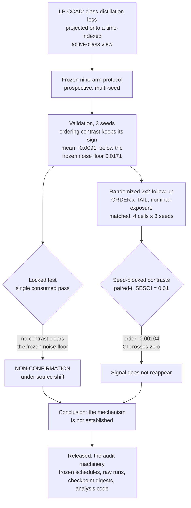

# LP-CCAD Audit: Label-Space Curriculum Distillation Under a Locked Test

**A validation ordering signal in curriculum distillation — sign-consistent
across three seeds, never above the pre-registered noise floor — fails a locked
test and a randomized follow-up; the audit framework is the contribution.**

Companion code and frozen results for *"Auditing Label-Space Curriculum
Distillation: A Validation Ordering Signal Fails a Locked Test and a Randomized
Follow-Up"* (Liu & Jang). Paper: **[link to be added on acceptance /
preprint]**. The manuscript is unpublished and has not been peer reviewed.

## The audit in one diagram



## Key findings

1. **What replicated on validation was a direction, not a confirmed effect.**
   The tail-matched ordering contrast kept its sign at all three validation
   seeds (`+0.01159 / +0.00853 / +0.00723`, mean `+0.0091`) — but that mean
   sits below the pre-registered noise floor (`0.0171`), so even on validation
   the frozen decision rule returns *inconclusive* rather than a confirmed
   effect. On the locked test no contrast cleared that noise floor and the
   ordering contrast reversed sign — on a split whose source composition
   differs materially from validation's, so the outcome is a failure to
   transport as much as a failure to replicate. In a randomized follow-up
   matched on nominal exposure the contrast did not reappear
   (`order = -0.00104`, 95% CI `[-0.01315, +0.01107]`) — though that follow-up
   changed the evidence-admission pipeline at the same time as it randomized
   the schedule, so the disappearance cannot be assigned to randomization
   alone.
2. **What is matched is nominal exposure, not effective dose.** All nine
   randomized schedules carry the *exact* C4-M global view multiset (30 full /
   20 per group and pairwise view / 14-13-13 singles; 124-83-83 per-class
   active epochs), so nominal per-class exposure is matched as realized rather
   than only by intention; only the ordering and the tail composition differ,
   and `tests/test_schedule_multiset.py` pins it. This is *not* effective-dose
   matching: identical view multisets can still integrate different
   optimization dose, because learning rate, parameter state and the number of
   admitted evidence pairs vary along the path. The paper carries that as a
   disclosed limitation, and effective KD dose survives as a competing
   explanation it cannot exclude.
3. **Descriptively, no cell sat above not distilling.** All four factorial
   cell means fall below the no-KD C0-R baseline on the same validation split
   and evaluator, and 11 of the 12 paired per-seed differences against C0-R
   are negative (the exception is mono x single at seed 42, `+0.00449`). No
   superiority or non-inferiority test against C0-R was pre-specified and none
   is performed here, so this is a descriptive observation about where the
   cells sit — not an inferential claim that curriculum distillation is at
   most neutral.
4. **The equivalence result is weaker than it looks.** ORDER is equivalent to
   zero at the uncorrected 5% level for the single pre-designated primary
   (TOST `p = 0.043`) and stops being so after Holm across the three
   equivalence tests (`0.13`). We report it that way rather than rounding it
   into a claim.
5. **Two audit details changed conclusions and are released as code**: the
   integer letterbox padding convention in the teacher/GT adapter (a sub-pixel
   offset — mean 0.10 px, max 0.50 px — that a hard 0.999-IoU admission gate
   converted into the silent removal of ~21% of otherwise-eligible
   distillation pairs), and the clone-and-renumber rule in the source-clustered
   bootstrap (without it a replicate silently collapses back to the baseline —
   `tests/test_bootstrap_duplicate_ids.py` demonstrates it).

## Installation

```bash
git clone <this repository>
cd lp-ccad-audit
python3 -m venv .venv && source .venv/bin/activate
pip install -r requirements.txt
```

Table reproduction needs **nothing but the Python standard library**; the
requirements file covers the tests, the figures and the synthetic example.
`ultralytics` is *not* installed by `requirements.txt` — see
[docs/THIRD_PARTY_NOTICES.md](docs/THIRD_PARTY_NOTICES.md).

## Quick start

```bash
python3 scripts/reproduce_tables.py     # live calculations + frozen bootstrap CI verification
pytest -q                               # the invariants behind those tables
```

Expected output, line for line, is in
[docs/EXPECTED_OUTPUTS.md](docs/EXPECTED_OUTPUTS.md).

## Reproduce the tables and figures

| command | produces |
|---|---|
| `python3 scripts/reproduce_tables.py` | Table 10 (effects, paired-$t$ CIs, TOST, Holm — recomputed live), Table 11 (twelve raw runs, C0-R row, paired diffs, seed-blocked contrasts, checkpoint digests), locked-test primaries and contrasts, frozen bootstrap CIs, and ASLs recomputed from the released replicate table |
| `python3 scripts/reproduce_figures.py` | Fig. 5B and the two locked-test panels from the CSVs; prints the values instead if matplotlib is absent, and lists the paper figures that are *not* regenerable here |
| `python3 scripts/verify_schedule_exposure.py` | the human-readable nominal-exposure ledger (global view multiset, per-class active epochs, head/tail cardinality mix) for all nine randomized schedules |
| `python3 examples/synthetic_minimal_example.py` | the projection loss on synthetic data, including the single-view gradient property |

## Repository layout

```
lpccad/         the code the claims rest on: projection losses, the
                teacher/GT evaluation adapter, the factorial schedule builder
scripts/        analysis and reproduction entry points
configs/        frozen protocol, the factorial schedule file + its sha256,
                decision rule, seeds and analysis constants
results/        frozen real numbers: 12 factorial runs, C0-R baseline,
                locked-test primaries, bootstrap CIs, paper headline metrics
tests/          runnable pytest invariants (schedules, statistics, bootstrap)
examples/       a self-contained synthetic demonstration
docs/           provenance, reproducibility, data access, notices, expected output
```

## Restricted data

No images, videos, datasets or checkpoints are in this repository, and none may
be added. The corpus is assembled from third-party research datasets that we
have no right to redistribute; access for verification is by data-use agreement,
requested from the corresponding author and, once the manuscript is with a
journal, routed through the handling editor. See
[docs/RESTRICTED_DATA_ACCESS.md](docs/RESTRICTED_DATA_ACCESS.md) and
[docs/DATA_PROVENANCE.md](docs/DATA_PROVENANCE.md).

## Repository scope

This is a **minimal reproducibility release**, not a framework. It contains the
analysis chain from the frozen per-run metrics to the reported numbers, the
method code those runs used, and the configuration that made the comparison
fair. It deliberately does **not** contain the training supervisor, the dataset
tooling, the checkpoints, or a copy of any upstream framework. What can and
cannot be reproduced from it is stated explicitly in
[docs/REPRODUCIBILITY.md](docs/REPRODUCIBILITY.md) — the tier that needs
restricted data and GPUs is named as such rather than implied to be one command
away.

## Expected outputs

See [docs/EXPECTED_OUTPUTS.md](docs/EXPECTED_OUTPUTS.md) for the exact printed
tables, the pytest summary lines with and without optional dependencies, and
the rounding notes that explain the small differences between the printed paper
and the 5-decimal script output.

## Citation

```bibtex
@unpublished{liu_jang_lpccad_audit,
  author  = {Liu, Wei and Jang, Seojin},
  title   = {Auditing Label-Space Curriculum Distillation: A Validation
             Ordering Signal Fails a Locked Test and a Randomized Follow-Up},
  note    = {Unpublished manuscript, not peer reviewed; prepared for
             submission to Machine Learning with Applications. Venue,
             volume, pages and DOI to be added if and when published},
  year    = {2026}
}
```

`CITATION.cff` carries the same metadata in machine-readable form. Update both
when the DOI is issued.

Published tags must never be force-moved. Corrections receive a new versioned
tag and an external object-level manifest; see
[docs/RELEASE_POLICY.md](docs/RELEASE_POLICY.md).

## License

MIT — see [`LICENSE`](LICENSE). The licence covers **this repository's code,
configs and result tables only**. It does not and cannot relicense the
constituent datasets, which remain governed by their own terms (see
[docs/DATA_PROVENANCE.md](docs/DATA_PROVENANCE.md)); no imagery, labels or
model weights are distributed here.


## Acknowledgements

The randomized follow-up, the source-clustered bootstrap, the equivalence
testing and the explicit licence audit of the constituent datasets were all
added in response to **internal adversarial review** — rounds of deliberate
self-critique the authors ran on their own manuscript before submission. This
work has not been through journal peer review, and none of these additions came
from external reviewers; internal review is nonetheless what materially
improved the honesty of the reported result. Dataset constituents are credited
in [docs/DATA_PROVENANCE.md](docs/DATA_PROVENANCE.md); the teacher (D-FINE) and
the student framework (Ultralytics) are credited in
[docs/THIRD_PARTY_NOTICES.md](docs/THIRD_PARTY_NOTICES.md).
