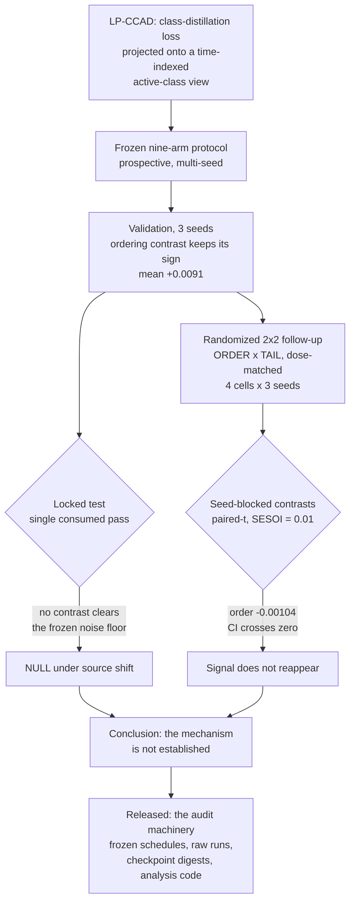

# LP-CCAD Audit: Label-Space Curriculum Distillation Under a Locked Test

**A replicated validation ordering signal in curriculum distillation failed a
locked test and a randomized follow-up; the audit framework is the
contribution.**

Companion code and frozen results for *"Auditing Label-Space Curriculum
Distillation: A Validation Ordering Signal Fails a Locked Test and a Randomized
Follow-Up"* (Liu & Jang). Paper: **[link to be added on acceptance /
preprint]**.

## The audit in one diagram



## Key findings

1. **The validation signal was real and it did not survive.** The tail-matched
   ordering contrast kept its sign across three validation seeds (mean
   `+0.0091`), then produced nothing on the locked test — where the source
   composition shifts materially — and nothing in a randomized, dose-matched
   follow-up (`order = -0.00104`, 95% CI `[-0.01315, +0.01107]`).
2. **Dose was never the explanation.** All nine randomized schedules carry the
   *exact* C4-M global view multiset (30 full / 20 per group and pairwise view
   / 14-13-13 singles; 124-83-83 per-class active epochs). Only the ordering
   and the tail composition differ. `tests/test_schedule_multiset.py` pins this.
3. **Curriculum distillation did not beat not distilling.** 11 of the 12
   factorial runs score *below* the no-KD C0-R baseline on the same validation
   split and evaluator.
4. **The equivalence result is weaker than it looks.** ORDER is equivalent to
   zero at the uncorrected 5% level (TOST `p = 0.043`) and stops being so after
   Holm (`0.13`). We report it that way rather than rounding it into a claim.
5. **Two audit details changed conclusions and are released as code**: the
   integer letterbox padding convention in the teacher/GT adapter (a ~0.5 px
   common-mode offset), and the clone-and-renumber rule in the source-clustered
   bootstrap (without it a replicate silently collapses back to the baseline —
   `tests/test_bootstrap_duplicate_ids.py` demonstrates it).

## Installation

```bash
git clone <this repository>
cd lp-ccad-audit
python3 -m venv .venv && source .venv/bin/activate
pip install -r requirements.txt
```

Table reproduction needs **nothing but the Python standard library**; the
requirements file covers the tests, the figures and the synthetic example.
`ultralytics` is *not* installed by `requirements.txt` — see
[docs/THIRD_PARTY_NOTICES.md](docs/THIRD_PARTY_NOTICES.md).

## Quick start

```bash
python3 scripts/reproduce_tables.py     # Tables 10 & 11, locked test, bootstrap
pytest -q                               # the invariants behind those tables
```

Expected output, line for line, is in
[docs/EXPECTED_OUTPUTS.md](docs/EXPECTED_OUTPUTS.md).

## Reproduce the tables and figures

| command | produces |
|---|---|
| `python3 scripts/reproduce_tables.py` | Table 10 (effects, paired-$t$ CIs, TOST, Holm — all recomputed live), Table 11 (twelve raw runs, C0-R row, paired diffs, seed-blocked contrasts, checkpoint digests), the locked-test primaries and the bootstrap intervals |
| `python3 scripts/reproduce_figures.py` | Fig. 5B and the two locked-test panels from the CSVs; prints the values instead if matplotlib is absent, and lists the paper figures that are *not* regenerable here |
| `python3 scripts/verify_schedule_exposure.py` | the human-readable dose/exposure ledger for all nine randomized arms |
| `python3 examples/synthetic_minimal_example.py` | the projection loss on synthetic data, including the single-view gradient property |

## Repository layout

```
lpccad/         the code the claims rest on: projection losses, the
                teacher/GT evaluation adapter, the factorial schedule builder
scripts/        analysis and reproduction entry points
configs/        frozen protocol, the factorial schedule file + its sha256,
                decision rule, seeds and analysis constants
results/        frozen real numbers: 12 factorial runs, C0-R baseline,
                locked-test primaries, bootstrap CIs, paper headline metrics
tests/          runnable pytest invariants (schedules, statistics, bootstrap)
examples/       a self-contained synthetic demonstration
docs/           provenance, reproducibility, data access, notices, expected output
```

## Restricted data

No images, videos, datasets or checkpoints are in this repository, and none may
be added. The corpus is assembled from third-party research datasets that we
have no right to redistribute; access for verification is by data-use agreement
through the journal editor. See
[docs/RESTRICTED_DATA_ACCESS.md](docs/RESTRICTED_DATA_ACCESS.md) and
[docs/DATA_PROVENANCE.md](docs/DATA_PROVENANCE.md).

## Repository scope

This is a **minimal reproducibility release**, not a framework. It contains the
analysis chain from the frozen per-run metrics to the published numbers, the
method code those runs used, and the configuration that made the comparison
fair. It deliberately does **not** contain the training supervisor, the dataset
tooling, the checkpoints, or a copy of any upstream framework. What can and
cannot be reproduced from it is stated explicitly in
[docs/REPRODUCIBILITY.md](docs/REPRODUCIBILITY.md) — the tier that needs
restricted data and GPUs is named as such rather than implied to be one command
away.

## Expected outputs

See [docs/EXPECTED_OUTPUTS.md](docs/EXPECTED_OUTPUTS.md) for the exact printed
tables, the pytest summary lines with and without optional dependencies, and
the rounding notes that explain the small differences between the printed paper
and the 5-decimal script output.

## Citation

```bibtex
@article{liu_jang_lpccad_audit,
  author  = {Liu, Wei and Jang, Seojin},
  title   = {Auditing Label-Space Curriculum Distillation: A Validation
             Ordering Signal Fails a Locked Test and a Randomized Follow-Up},
  journal = {Machine Learning with Applications},
  note    = {Preprint; volume, pages and DOI to be added},
  year    = {2026}
}
```

`CITATION.cff` carries the same metadata in machine-readable form. Update both
when the DOI is issued.

## License

Not yet fixed — see [`LICENSE_PENDING`](LICENSE_PENDING). The repository code is
standalone and interfaces with AGPL-3.0 Ultralytics only at arm's length, so
MIT, BSD-3-Clause and Apache-2.0 are all viable; the choice is reserved to the
authors.

## Acknowledgements

The randomized dose-matched follow-up, the source-clustered bootstrap, the
equivalence testing and the explicit licence audit of the constituent datasets
were all added in response to reviewer requests; the review process materially
improved the honesty of the reported result. Dataset constituents are credited
in [docs/DATA_PROVENANCE.md](docs/DATA_PROVENANCE.md); the teacher (D-FINE) and
the student framework (Ultralytics) are credited in
[docs/THIRD_PARTY_NOTICES.md](docs/THIRD_PARTY_NOTICES.md).
